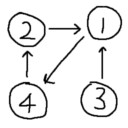
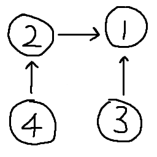
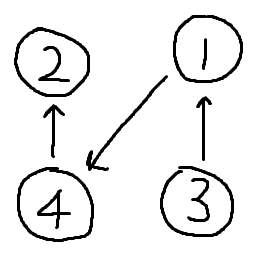
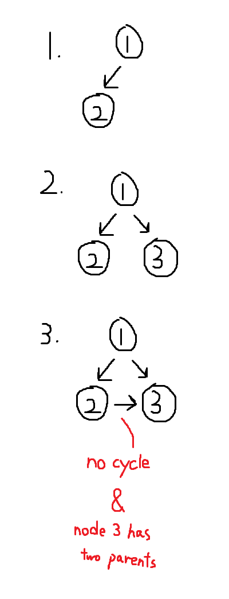
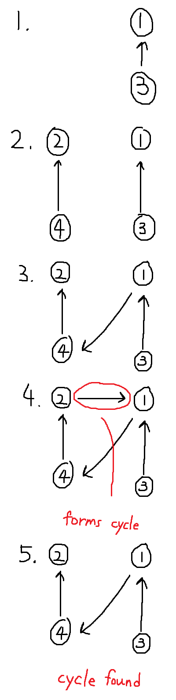
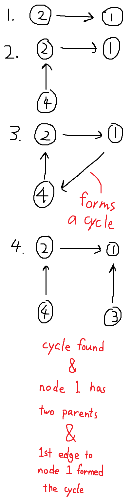

# Description

> In this problem, a rooted tree is a directed graph such that, there is exactly one node (the root) for which all other nodes are descendants of this node, plus every node has exactly one parent, except for the root node which has no parents.
>
> The given input is a directed graph that started as a rooted tree with N nodes (with distinct values 1, 2, ..., N), with one additional directed edge added. The added edge has two different vertices chosen from 1 to N, and was not an edge that already existed.
>
> The resulting graph is given as a 2D-array of edges. Each element of edges is a pair [u, v] that represents a directed edge connecting nodes u and v, where u is a parent of child v.
>
> Return an edge that can be removed so that the resulting graph is a rooted tree of N nodes. If there are multiple answers, return the answer that occurs last in the given 2D-array.

[Redundant Connection II - LeetCode](https://leetcode.com/problems/redundant-connection-ii/)

## Notes

* The given graph is an invalid rooted tree graph with one redundant edge. The tree becomes valid after removing the redundant edge.
* If there are multiple choices to remove, choose the one that is added last.
* The order of edges is important (for solving the problem in the following way).

## Steps

1. Find if any edge will construct a cycle by union find. If an edge will form a cycle, store that edge and **ignore it in step 2**.
1. Find if any node has two parents.
1. If a node has two parents and no cycle found, the edge from the second parent to that node is redundant. [(Example 1)](#solve-it-by-hand)
1. If a node has two parents and a cycle is found, the edge from the first parent to that node formed the cycle. [(Example 3)](#solve-it-by-hand)
1. If no node has two parents, the edge that formed a cycle is the redundant edge. [(Example 2)](#solve-it-by-hand)

## Cases

Case 1 | Case 2 | Case 3
-------|--------|-------
 |  | 

Case 1 is invalid since node 1 has two parents. After removing the edge from node 1 to node 4, it becomes case 2.

In case 2, both node 3 and 4 have no parent which mean there are two root nodes. Also, node 1 still has two parents.

By removing the edge from node 2 to node 1 in case 1, the tree becomes valid and is shown in case 3.

# Examples

Example 1 | Example 2 | Example 3
-------|--------|-------
Input: `[[1,2],[1,3],[2,3]]` | Input: `[[3,1],[1,4],[4,2],[2,1]]` | Input: `[[2,1],[4,2],[1,4],[3,1]]`
 |  | 

# Code

```javascript
/**
 * @param {number[][]} edges
 * @return {number[]}
 */
var findRedundantDirectedConnection = function(edges) {
    console.log("================================");
    console.log("Input:", edges);
    
    // parents[c] lists parents of node c
    const parents = new Array(edges.length + 1).fill().map(e => []);
    let cycleEdge = null;
    
    // Find the root of node p
    const find = (p, c) => {
        let root = p;
        while (parents[root].length) {
            root = parents[root][0];
            // Cycle found if the root of p is c
            if (root === c || root === p) {
                break;
            }
        }
        return root;
    };
    
    for (const edge of edges) {
        const p = edge[0], c = edge[1];
        
        if (find(p, c) === c) {
            cycleEdge = edge;
            continue;
        }
        
        parents[c].push(p);
        
        console.log("Edge:", edge, "Parents:", parents);
    }
    
    console.log("[Result] Parents:", parents, "CycleEdge:", cycleEdge);
    
    // Check if any node has two parents
    const node = parents.findIndex(e => e.length > 1);
    
    // No node have two parents, cycleEdge is the edge that forms cycle. (Example 2)
    if (node === -1) {
        return cycleEdge;
    }
    
    // A node has two parents, the edge to second parent is redundant. (Example 1)
    if (cycleEdge === null) {
        return [parents[node][1], node];
    }
    
    // A node has two parents, the edge to first parent forms cycle. (Example 3)
    return [parents[node][0], node];
};
```
